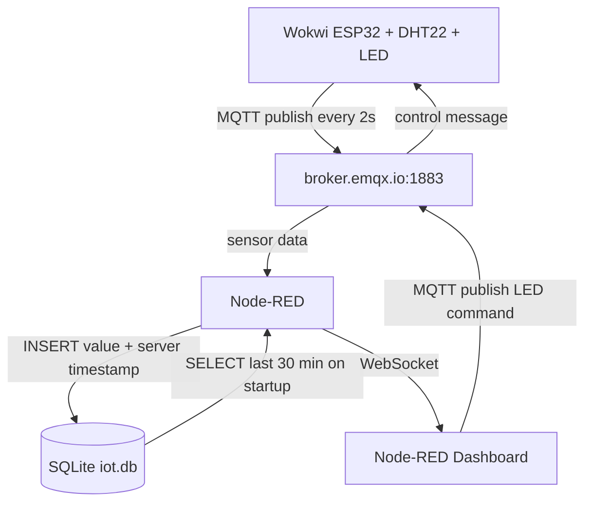

# Assignment: Internet of Things (IoT)

Hardware and sensors are increasingly integrated into everyday products. As a web developer, understanding how to communicate with connected devices using lightweight protocols is a valuable skill.

In this assignment, you will build an end-to-end IoT pipeline: simulate a device, publish sensor data through MQTT, store and process data in your backend, and present it in a real-time web dashboard that can also send commands back to the device.

## Learning Outcomes

By completing this assignment, you will:
- Collect and stream real-time sensor data using MQTT.
- Design a basic architecture for IoT data ingestion and visualization.
- Store time-series data in a suitable database.
- Build a bi-directional dashboard for monitoring and control.

## Assignment Description

You will simulate an IoT device in [Wokwi](https://wokwi.com/). The simulated device should:
- Read values from a sensor (or sensors).
- Publish sensor data to an MQTT broker on a recurring interval.
- Subscribe to command topics and react to incoming control messages (for example, toggling an LED).

You will also build a dashboard interface that:
- Subscribes to sensor updates in real time.
- Visualizes current and/or historical values.
- Publishes command messages back to the device.

You are expected to implement persistence and realtime data handling using one of these mandatory implementation paths:
- **Path A (Custom app stack):** custom backend + custom dashboard UI.
- **Path C (Node-RED stack):** Node-RED flow + Node-RED dashboard UI.

## Minimum Requirements (Mandatory / G)

Your solution must include:
- A working Wokwi simulation.
- A data-processing layer that ingests sensor data from MQTT (custom backend or Node-RED flow).
- MQTT publish and subscribe flows (device -> dashboard/backend and dashboard -> device).
- A deployed dashboard UI (custom frontend or Node-RED dashboard).
- Persistent data storage in a database of your choice.
- A historical data access layer for dashboard initialization (custom API or Node-RED data flow).
- A short report documenting your implementation.

Wokwi setup:
- Use a starter project that is provided in Moodle
- Or build your own equivalent setup (MCU + sensor + LED).

## Recommended MQTT Topics and Payloads

Use your own topic namespace to avoid collisions. Replace `[student_id]` with your own identifier.

### Sensor Data (published by Wokwi)
- **Topic:** `lnu/iot/[student_id]/sensor`
- **Payload (JSON):**

```json
{
  "value": 45,
  "timestamp": 1710063386
}
```

### Device Commands (published by dashboard, subscribed by Wokwi)
- **Topic:** `lnu/iot/[student_id]/command/led`
- **Payload (JSON):**

```json
{
  "state": true
}
```

If you use additional sensors or controls, document all related topics and payload schemas in your report.

## Submission Report Template

Include the following sections in your report:

### 1) Project Links
- **Live Dashboard URL:** [Läggs till efter deploy]
- **Wokwi Simulation URL:** https://wokwi.com/projects/322577683855704658
- **Backend/Database URL:** Node-RED (körs lokalt, se deploy-instruktioner)
- **Repository URL:** https://gitlab.lnu.se/1dv027/student/na223jy/assignment-iot

### 2) Project Overview

This project implements an end-to-end IoT pipeline using a simulated ESP32 device in Wokwi. The device reads temperature data from a DHT22 sensor every 2 seconds and publishes it via MQTT to a Node-RED backend, which stores the data in a SQLite database and visualizes it on a real-time dashboard.

**Simulated hardware:**
- ESP32 DevKit C v4 microcontroller
- DHT22 temperature sensor (pin 15)
- Red LED (pin 2)

**Dashboard features:**
- Real-time temperature gauge showing current value in °C
- Line chart displaying temperature history for the last 30 minutes
- Buttons to remotely toggle the LED on the simulated device on/off

### 3) Architecture and Data Flow

Data flows through the system in two directions:

**Sensor data (device → dashboard):** The Wokwi ESP32 reads temperature from a DHT22 sensor every 2 seconds and publishes a JSON payload to `lnu/iot/na223jy/sensor` via MQTT. Node-RED receives the message, appends a server-side timestamp, and stores it in SQLite. The Node-RED dashboard subscribes to the same topic and updates the gauge and chart in real time over WebSocket.

**Commands (dashboard → device):** When the user clicks a button in the Node-RED dashboard, a JSON command is published to `lnu/iot/na223jy/command/led` via MQTT. The Wokwi ESP32 is subscribed to this topic and toggles the LED accordingly.

**Historical data (Path C):** On dashboard start, an inject node automatically triggers a Node-RED flow that queries SQLite for sensor data from the last 30 minutes (`SELECT * FROM sensor_data WHERE timestamp > ? ORDER BY id ASC`) and pushes the result to the dashboard chart.



### 4) Database Strategy
- **Database chosen:** SQLite – a lightweight, file-based relational database managed via the `node-red-node-sqlite` node in Node-RED. Stored locally in `iot.db`.
- **Data model:** A single table `sensor_data` with the following schema:

| Column    | Type    | Description                        |
|-----------|---------|------------------------------------|
| id        | INTEGER | Auto-incrementing primary key      |
| value     | REAL    | Temperature reading in °C          |
| timestamp | INTEGER | Unix timestamp in seconds          |

- **Time-series considerations:** Data is inserted on every sensor publish (every 2 seconds). Server timestamp is stored in milliseconds (`Date.now()`). Historical data is retrieved with `SELECT * FROM sensor_data WHERE timestamp > ? ORDER BY id ASC` where the parameter is `Date.now() - 30 * 60 * 1000` (30 minutes ago). No explicit retention policy is applied for this assignment scope.

### 5) MQTT Topics and Payload Documentation

**Broker:** `broker.emqx.io:1883`

#### Sensor data – published by Wokwi, subscribed by Node-RED
- **Topic:** `lnu/iot/na223jy/sensor`
- **Direction:** Wokwi → Node-RED
- **Interval:** every 2 seconds
- **Payload:**
```json
{ "value": 24.0, "timestamp": 104 }
```

#### LED command – published by Node-RED dashboard, subscribed by Wokwi
- **Topic:** `lnu/iot/na223jy/command/led`
- **Direction:** Node-RED Dashboard → Wokwi
- **Payload (turn on):**
```json
{ "state": true }
```
- **Payload (turn off):**
```json
{ "state": false }
```

### 6) Reflection
Answer the following:
1. Which frontend technologies did you choose, and why?

- I chose Node-RED dashboard because it is the native UI layer for Path C and allows building a complete interface without writing any custom HTML or JavaScript. The dashboard nodes (gauge, chart, button) connect directly to the MQTT flows, meaning real-time updates work out of the box without additional code.

2. How does handling real-time MQTT data over WebSockets differ from a standard REST API workflow?

- With a REST API, the client sends a request and waits for a response — communication is always initiated by the client. With MQTT over WebSocket, the server maintains an open connection and pushes data to the client as soon as new data arrives. This means the dashboard updates immediately when the sensor publishes a new value, without needing to poll an endpoint on a timer.

3. What was the most challenging integration step (hardware, broker, backend, database, frontend), and how did you solve it?

- The most challenging step was getting the MQTT connection to work reliably between Wokwi and broker.emqx.io. Wokwi uses its own IoT gateway (netwi.wokwi.com) to provide internet access to the simulation, and this gateway went down at one point, causing the simulation to hang on "Connecting to WiFi". The problem was difficult to debug because the error was not in my code but in Wokwi's infrastructure. It resolved itself once the gateway recovered.

## Hand-in Instructions

Submit your work by creating a Merge Request targeting the `lnu/submit-branch`.

If you used additional repositories or external services, include links to them in your submission report.

## Grade Levels

- **G:** Complete all mandatory requirements in this README.
- **VG:** Complete all mandatory requirements **and** at least one optional VG extension.

### Grading Policy Mapping

- **Mandatory (G) mapping:** Equivalent to completing Issue 1-7 in `ISSUES.md`.
- **Issue 4 path rule:** You must complete either Path A (custom API) or Path C (Node-RED historical access), and document your chosen approach.
- **Optional (VG) mapping:** Equivalent to completing at least one of VG-A, VG-B, or VG-C in `ISSUES.md`.

For any VG extension, include:
- Security considerations (secrets handling, credentials, access restrictions).
- Evidence (screenshots/video/logs) and short technical reflection.

